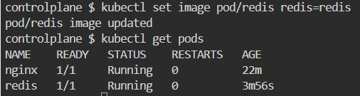

# k8s-lab1

1- How many pods exist on the system?

2- How many Nodes exist on the system?

3- Create a new pod with the nginx image.
    Image name: nginx

4- Which nodes are these pods placed on?
the pods are placed in node01

5- Create pod from the below yaml using kubectl apply command

6- How many containers are part of the pod webapp?
only 2 containers >> nginx and agentx

7- What images are used in the new webapp pod?
nginx and agentx

8- What is the state of the container agentx in the pod webapp

9- Why do you think the container agentx in pod webapp is in error?
The container agentx in pod webapp is in error because the image agentx is not found 

10- Delete the webapp Pod.

11- Create a new pod with the name redis and with the image redis123.
•	Name: redis
•	Image Name: redis123

12- Now change the image on this pod to redis.
Once done, the pod should be in a running state.

13- Create a pod called my-pod of image nginx:alpine

14- Delete the pod called my-pod

